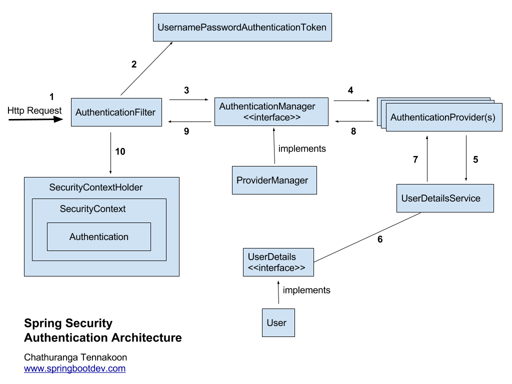

Spring Security : Authentication Architecture
Here is the diagram for demonstrating list of classes and filters involved in spring security authentication process.

Spring Security Architecture

1.Received the Http Request 
Spring security has a series/chain of filters. Therefore when a request comes, it will go through a chain of filters for authentication and authorization purposes. When there is an user authentication request, that will also go through the chain of filters as usual until it finds the relevant Authentication Filter based on the authentication mechanism/model.

E.g:- HTTP Basic authentication request goes through the chain of filters until it reaches the BasicAuthenticationFilter.

HTTP Digest authentication request goes through the chain of filters until it reaches the DigestAuthenticationFilter.

Login form submission request (login form authentication request)  goes through the chain of filters until it reaches the UsernamePasswordAuthenticationFilter.       

x509 authentication request goes through the chain of filters until it reaches the X509AuthenticationFilter etc…

 

2. Creates AuthenticationToken based on user credentials
Once the authentication request is received by the relevant AuthenticationFilter, it extracts the username and password from the received request (most of the authentication mechanism require username and password). After that it creates an Authentication object based on the extracted user credentials.

If the extracted credentials are username and password, then UsernamePasswordAuthenticationToken will be created using username and password extracted/found.

 

3. Delegating created AuthenticationToken for AuthenticationManagager
After creating the UsernamePasswordAuthenticationToken object ,it will be used to invoke the authenticate method of the AuthenticationManager. AuthenticationManager is a just an interface and actual implementation is ProviderManager.

AuthenticationManager.java

1
2
3
4
public interface AuthenticationManager
{
  Authentication authenticate(Authentication authentication)throws AuthenticationException;
}
ProviderManager has a list of configured AuthenticationProvider(s) that should be used for authenticating user requests. ProviderManager will go through each of the provided AuthenticationProvider(s) and try to authenticate the user based on the passed Authentication Object (e.g:- UsernamePasswordAuthenticationToken)

 

4.Trying to authenticate with list of AuthenticationProvider(s)
AuthenticationProvider tries to authenticate user with provided authentication object.

1
2
3
4
5
6
public interface AuthenticationProvider {
 
    Authentication authenticate(Authentication authentication) throws AuthenticationException;
 
    boolean supports(Class<?> authentication);
}
Here are some of the existing authentication providers that comes with the framework:

CasAuthenticationProvider
JaasAuthenticationProvider
DaoAuthenticationProvider
OpenIDAuthenticationProvider
RememberMeAuthenticationProvider
LdapAuthenticationProvider
5. UserDetailsService Required?
Some of the AuthenticationProvider may use UserDetailsService for retrieving the user details based on the username. (e.g:- DaoAuthenticationProvider)

1
2
3
4
public interface UserDetailsService
{
  UserDetails loadUserByUsername(String username) throws UsernameNotFoundException;
}
6 and 7 . UserDetails or User Object?
 UserDetailsService will retrieve the UserDetails (actual implementation is User) based on the username.

8. Authentication Object Or AuthenticationException?
If the user is successfully authenticated, then the fully populated Authentication object will be returned. Otherwise an AuthenticationException will be thrown.

According to the AuthenticationProvider interface,  AuthenticationProvider will exactly return fully populated authentication object (on successful authentication) or throw an AuthenticationException (on authentication failure)

Fully populated Authentication Object

authenticated – true

grant authorities list

user credentials (username only)

If any AuthenticationException is thrown, that will be handled by the configured AuthenticationEntryPoint that supports for the authentication mechanism.

9. Authentication is done!
AuthenticationManager will return the obtained fully populated Authentication object back to the relevant Authentication Filter.

10. Setting up Authentication Object in SecurityContext
Then the related AuthenticationFilter will store the obtained authentication object in the SecurityContext for future filter uses. (Use for Authorization Filters)

SecurityContextHolder.getContext().setAuthentication(authentication);

Hope This will help you to understand the Spring Security Authentication Architecture in depth up-to some extent.
